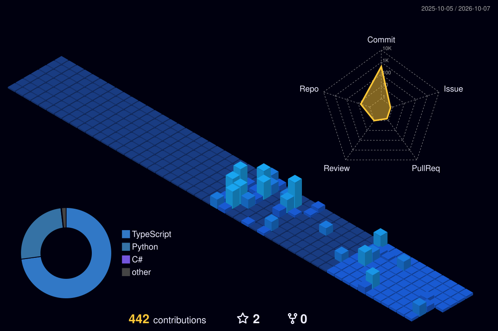

<!-- 🎬 HERO — video intro + name -->

  

<!-- 👨‍💻 LEFT: what I build   •   🏗️ RIGHT: life outside code -->

  

<!-- ⚛️ TECH STACK -->

  

<!-- 🪪 DEVELOPER ID + DASHBOARD -->

  

## 🚀 Featured builds

| Project | What it is | Stack | Stars |
|:---|:---|:---|:---:|
| [**Facebook-Automation**](https://github.com/sikander1020/Facebook-Automation) | AI-powered social video automation — importing, smart clipping, merging, AI generation & dubbing | `Python` `AI` | ⭐ 1 |
| [**zaybaash**](https://github.com/sikander1020/zaybaash) | Store front-end build | `TypeScript` | ⭐ 1 |
| [**Forge-AI-Pentest-Assistant**](https://github.com/sikander1020/Forge-AI-Pentest-Assistant) | ForgeAI — autonomous AI penetration-testing assistant with a secure sandbox and 100+ models | `TypeScript` `AI` | ⭐ 0 |
| [**N8N-Workflows**](https://github.com/sikander1020/N8N-Workflows) | Automation workflow collection | `n8n` | ⭐ 0 |
| [**mobile-shop-pos**](https://github.com/sikander1020/mobile-shop-pos) | Offline mobile-shop point-of-sale system | `C#` `.NET` | ⭐ 0 |
| [**Award-Portfolio**](https://github.com/sikander1020/Award-Portfolio) | Responsive portfolio build | `TypeScript` | ⭐ 0 |

 

## 🌃 My contribution city

*Every commit builds another tower — rebuilt automatically every day.*

  

<!-- 💌 LET'S CONNECT -->

  

 

**Always learning, always building.** 💜

